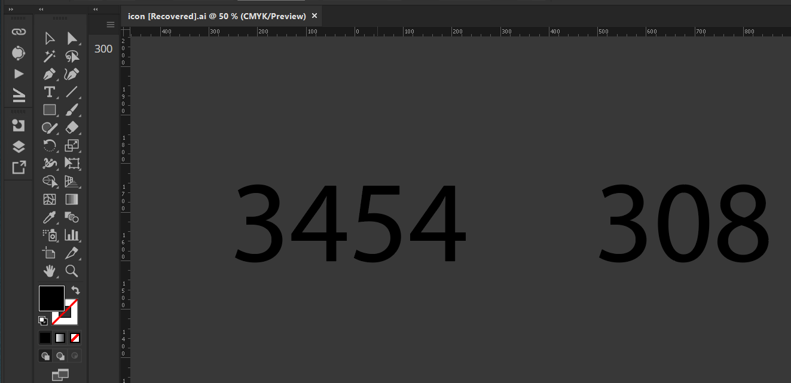

# Resolution



> [By request on Illustrator forums](https://community.adobe.com/t5/illustrator-discussions/settings-raster-effects-value-visible-main-screen/td-p/13689831)

## Use a ZXP installer with the [file located in archive](./archive/resolution_1.0.0.zxp) or set yourself up to debug unsigned extensions and use the zip.

### This panel is very barebones and [relies on AIHostAdapter](https://github.com/Adobe-CEP/CEP-Resources/tree/master/CEP_11.x/AIHostAdapter) to function, which you [must install manually in your program files](https://community.adobe.com/t5/illustrator-discussions/aihostadapter-plugin-windows-install/td-p/12727345) as an SDK extension. This panel creates a quick scripting call each time the selection of the document is changed to update in realtime, which could (on largest of files) interrupt a workflow. At the very least, it's a start.

The property that you were looking for in JSX/scripting would be:

```js
app.activeDocument.rasterEffectSettings.resolution;
```
